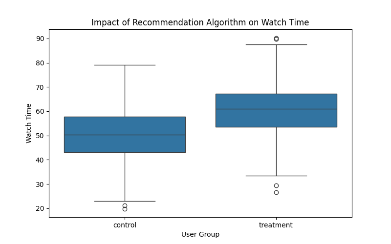

# Causal Impact of Recommendation Algorithms on User Engagement

## Overview

How much do recommendation algorithms actually impact user behavior?

In this project, I simulate an A/B test to measure the causal effect of a new recommendation system on user engagement. Using statistical testing and regression analysis, I estimate how changes in content personalization influence watch time.

## Key Question

Does improving content recommendations lead to a measurable increase in user engagement?

## Methods
- A/B testing (t-test)
- Regression analysis to estimate causal impact

## Key Results
- Statistically significant increase in watch time (p < 0.001)
- Estimated causal lift of ~10 units

## Business Impact

Findings suggest the recommendation algorithm meaningfully improves user engagement and should be considered for rollout.

If validated with real-world data, this could:
- Increase total watch time across the platform  
- Improve content discovery  
- Drive long-term user retention  

These insights support data-driven product decisions around personalization strategies.

## Visualization

